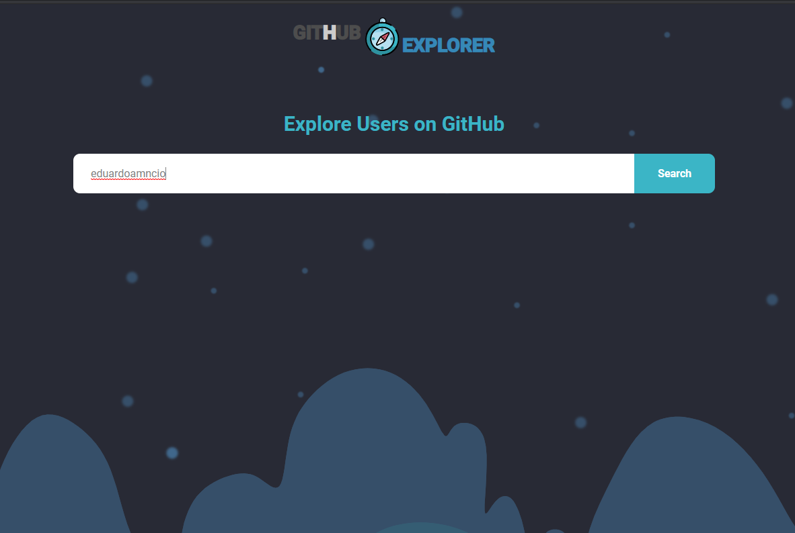
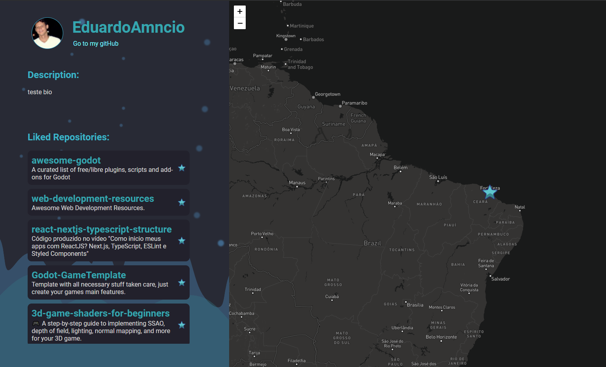

# Projeto criado para o Desafio Front-end - Time Live
**GreenMile Software**

## Tecnologias:
- ReactJs.
- Redux.
- Javascript.
## APIs:
- [API GitHub](https://api.github.com).
- [API de mapas MapBox](https://www.mapbox.com/).

## O resultado final pode ser acessado em:
[GitHubUserExplorer](https://5ff68d01cf221d000723f153--elated-meitner-e10c4a.netlify.app) - Via netlify.

## Para executar o projeto localmente:
### `yarn start`

## Descrição:
Independente do resultado agradeço pela oportunidade. Durante o projeto tive a possibilidade de aprender sobre redux e redux-saga que ainda não tinha trabalhado e sobre a utilização de mapas.

Apensar do tempo disponibilizado ser suficiente para a implementação do projeto (3 dias) na prática consegui trabalhar apenas duas noites, devido as demandas que tenho do trabalho atual. Então optei por fazer o projeto apenas como versão desktop, sem utilizar o padrão de mobile first. Mantive no projeto a utilização do redux para aproveitar a oportunidade e conhecer a tecnologia.

### Estrutura do projeto:
**src** - Mantém todo o código do projeto.
**assets** - Imagens utilizadas.
**Pages** - As páginas criadas 'Dashboard' e 'UseInfoMap'.
**Routes** - Estrutura para manipulação das rotas.
**Services** - Os serviços utilizados.
**Store** - Estrutura para utilização do redux.

### Utilização do projeto:
- Foi criado um campo de busca, para preenchimento do nome do usuário e botão para busca:

- Caso o usuário seja encontrado, será enviado para a pagina de detalhamento:

